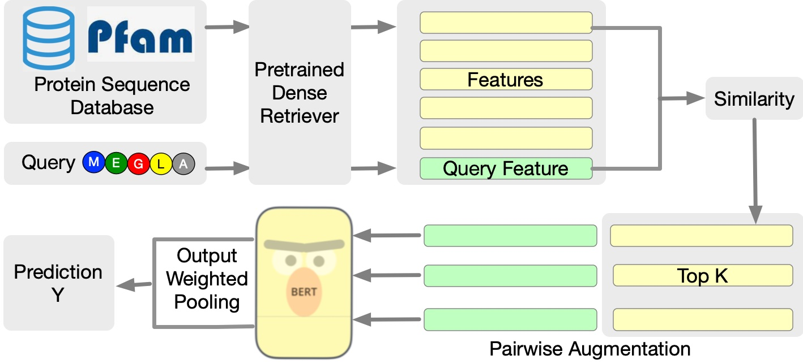
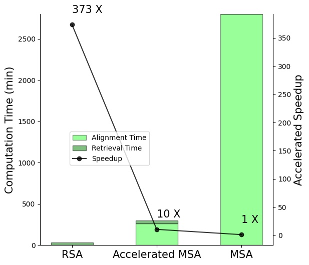

# RSA: Retrieved Sequence Augmentation for Protein Representation Learning


Code for paper [**Retrieved Sequence Augmentation for Protein Representation Learning**](to-be-added). Protein language models have excelled in a variety of tasks, ranging from structure prediction to protein engineering. However, proteins are highly diverse in functions and structures, and current state-of-the-art models including the latest version of AlphaFold rely on Multiple Sequence Alignments (MSA) to feed in the evolutionary knowledge. Despite their success, heavy computational overheads, as well as the de novo and orphan proteins remain great challenges in protein representation learning. In this work, we show that MSAaugmented models inherently belong to retrieval-augmented methods. Motivated by this finding, we introduce **Retrieved Sequence Augmentation (RSA)** for protein representation learning without additional alignment or pre-processing. RSA links query protein sequences to a set of sequences with similar structures or properties in the database and combines these sequences for downstream prediction. 


|   | |
|--|--|
|  |  |


## Repo Features

- support **RSA** model, as a **FASTER and ON-THE-FLY Processing** alternative to MSA-based models. 
- support data-preprocessing ([msa construction](https://github.com/chang-github-00/RSA#building-msa-features-for-tape), [retrieval database construction](https://github.com/chang-github-00/RSA#retrieval-database-preparation)).
- support baselines for protein function/structure prediction (transformers, ProtBert, MSA Transformer, and Potts Model).
- support benchmarks for protein function/structure prediction (including [TAPE](https://tape-benchmark.com/) and  [PEER](https://github.com/DeepGraphLearning/PEER_Benchmark)).


## Quick Start

1. Check available computation resources:

   Training an RSA-ProtBERT model requires a single Tesla V100/A100 GPU. 

   RSA-Transformer can run on a single RTX3090 ti GPU. 

2. Install environment based on [instructions](https://github.com/chang-github-00/RSA#Install environment).

3. Download the index files of Pfam from [google drive](https://drive.google.com/file/d/17gARm6jnroFQU1sDIVhskPP23VTqe1JI/view?usp=share_link) into folder */retrieval-db*. 

4. Download datasets. Thanks to sources [TAPE](https://github.com/songlab-cal/tape) and [PEER](https://github.com/DeepGraphLearning/PEER_Benchmark).

```
mkdir tape
cd tape
mkdir data
cd data

#Download Data Files
wget http://s3.amazonaws.com/songlabdata/proteindata/data_pytorch/secondary_structure.tar.gz
wget http://s3.amazonaws.com/songlabdata/proteindata/data_pytorch/proteinnet.tar.gz
wget http://s3.amazonaws.com/songlabdata/proteindata/data_pytorch/remote_homology.tar.gz
wget http://s3.amazonaws.com/songlabdata/proteindata/data_pytorch/fluorescence.tar.gz
wget http://s3.amazonaws.com/songlabdata/proteindata/data_pytorch/stability.tar.gz
wget https://miladeepgraphlearningproteindata.s3.us-east-2.amazonaws.com/peerdata/subcellular_localization.tar.gz
wget https://miladeepgraphlearningproteindata.s3.us-east-2.amazonaws.com/ppidata/human_ppi.zip

wget http://s3.amazonaws.com/songlabdata/proteindata/data_raw_pytorch/fluorescence.tar.gz
wget http://s3.amazonaws.com/songlabdata/proteindata/data_raw_pytorch/stability.tar.gz
wget http://s3.amazonaws.com/songlabdata/proteindata/data_raw_pytorch/remote_homology.tar.gz


tar -xzf secondary_structure.tar.gz 
tar -xzf proteinnet.tar.gz 
tar -xzf remote_homology.tar.gz 
tar -xzf fluorescence.tar.gz 
tar -xzf stability.tar.gz 
tar -xzf subcellular_localization.tar.gz
unzip human_ppi.zip

rm secondary_structure.tar.gz
rm proteinnet.tar.gz
rm remote_homology.tar.gz
rm fluorescence.tar.gz
rm stability.tar.gz
rm subcellular_localization.tar.gz
rm human_ppi.zip
```

4. Run script for RSA Training.

```bash
cd script/retrieval-protbert
bash run_contact.sh # contact prediction
bash run_ss8.sh # secondary structure prediction
bash run_ppi.sh # protein protein interaction
bash run_stability.sh # protein stability prediction
bash run_subcellular.sh # protein subcellular localization prediction
bash run_homology.sh # remote homology prediction
```

Note that you can input your wandb key in scripts for instant result visualization. 

```bash
export WANDB_API_KEY='write your api key here'
```


## Install environment

```bash
pip install faiss-gpu  # or pip install faiss-cpu

pip install -r requirements.txt
```


## Data Preprocess

### Building MSA features for TAPE

file organization 

```
├── databases
│   ├── pfam (including 6 files unzipped)
│   └── UniRef30_2020_06 (including 6 files unzipped)
├── data-preprocess
└── tape
    ├── data
    │   ├── proteinnet
    │   ├── remote_homology
    │   ├── secondary_structure
    │   └── stability
    ├── msa
    │   └── proteinnet
    │       └── proteinnet_train
    |   ......
    └── query
        ├── fluorescence
        │   ├── fluorescence_test
        │   ├── fluorescence_train
        │   └── fluorescence_valid
        ├── proteinnet
        │   ├── proteinnet_test
        │   ├── proteinnet_train
        │   └── proteinnet_valid
        ├── remote_homology
        │   ├── remote_homology_test_family_holdout
        │   ├── remote_homology_test_fold_holdout
        │   ├── remote_homology_test_superfamily_holdout
        │   ├── remote_homology_train
        │   └── remote_homology_valid
        ├── secondary_structure
        │   ├── secondary_structure_casp12
        │   ├── secondary_structure_cb513
        │   ├── secondary_structure_train
        │   ├── secondary_structure_ts115
        │   └── secondary_structure_valid
        └── stability
            ├── stability_test
            ├── stability_train
            └── stability_valid
```

1. setup tool hhblits 

```bash
pip install -r data-preprocess/requirements.txt

git clone https://github.com/soedinglab/hh-suite.git
mkdir -p hh-suite/build && cd hh-suite/build
cmake -DCMAKE_INSTALL_PREFIX=. ..
make -j 4 && make install
export PATH="$(pwd)/bin:$(pwd)/scripts:$PATH"

# install via conda
# conda install -c conda-forge -c bioconda hhsuite (这个命令暂时失效了)
```

2. obtain databases

```bash
mkdir databases
cd databases
pfam(15G) : 
    wget http://wwwuser.gwdg.de/~compbiol/data/hhsuite/databases/hhsuite_dbs/pfamA_32.0.tar.gz 
    mkdir pfam
    mv pfamA_32.0.tar.gz  pfam
    cd pfam
    tar -zxvf pfamA_32.0.tar.gz 
uniclust30(50G) : 
    wget http://wwwuser.gwdg.de/~compbiol/uniclust/2020_06/UniRef30_2020_06_hhsuite.tar.gz 
    mkdir UniRef30_2020_06
    mv UniRef30_2020_06_hhsuite.tar.gz UniRef30_2020_06
    cd UniRef30_2020_06
    tar -zxvf UniRef30_2020_06_hhsuite.tar.gz
```

3. download tape data

```bash
mkdir tape
cd tape
mkdir data
cd data

#Download Data Files
wget http://s3.amazonaws.com/songlabdata/proteindata/data_pytorch/secondary_structure.tar.gz
wget http://s3.amazonaws.com/songlabdata/proteindata/data_pytorch/proteinnet.tar.gz
wget http://s3.amazonaws.com/songlabdata/proteindata/data_pytorch/remote_homology.tar.gz
wget http://s3.amazonaws.com/songlabdata/proteindata/data_pytorch/fluorescence.tar.gz
wget http://s3.amazonaws.com/songlabdata/proteindata/data_pytorch/stability.tar.gz

wget http://s3.amazonaws.com/songlabdata/proteindata/data_raw_pytorch/fluorescence.tar.gz
wget http://s3.amazonaws.com/songlabdata/proteindata/data_raw_pytorch/stability.tar.gz
wget http://s3.amazonaws.com/songlabdata/proteindata/data_raw_pytorch/remote_homology.tar.gz


tar -xzf secondary_structure.tar.gz 
tar -xzf proteinnet.tar.gz 
tar -xzf remote_homology.tar.gz 
tar -xzf fluorescence.tar.gz 
tar -xzf stability.tar.gz 

rm secondary_structure.tar.gz
rm proteinnet.tar.gz
rm remote_homology.tar.gz
rm fluorescence.tar.gz
rm stability.tar.gz
```

4. generate tape queries for msa generation

```
python data-preprocess/create_msa_query.py --path tape
```

5. generate tape msa files with hhblits

```bash
bash  data-preprocess/run_step_5_msa_generation.sh
dataset=proteinnet # remote_homology stability secondary_structure fluorescence 
split=train # test valid 
# note that the test split for secondary_structure is named as casp12

# python data-preprocess/create_msa.py --database uniclust --dataset ${dataset} --type ${split} --cpu_num 64 --path tape --iterations 1 --cutoff 1
python data-preprocess/create_msa.py --database pfam --dataset ${dataset} --type ${split} --cpu_num 64 --path tape --iterations 3 --cutoff 1
```

6. generate training files with msa

```bash
python data-preprocess/create_msa_dataset.py --path 'tape'
```

-----------------------------------------

## Retrieval Database Preparation

file organization 

```
├── retrieval-db
│   ├── pfam_db_dumps (including all the dumps of the database)
            └── pfam-A0.json
            |   ......
│   └── pfam_vectors (including all the features of the dumps)
            └── vectors_dump_0.fvecs
            |   ......         
```

  1. download the retrieval sequence database

 ```bash
mkdir retrieval-db
cd retrieval-db
wget http://ftp.ebi.ac.uk/pub/databases/Pfam/current_release/Pfam-A.fasta.gz
wget https://ftp.uniprot.org/pub/databases/uniprot/uniref/uniref50/uniref50.fasta.gz  
 ```

  2. split the database into several dumps to allow parallel feature extraction

 ```bash
python batch_pfam.py (edit the num_dumps in this file)
 ```

  3. extract features for each dump

 ```bash
python extract_features --dump 0 --device 0 --batch_size 1
 ```

 Note that a Tesla V100 card can only hold batch_size 1 for ESM-1b pretrained model.

  4. merge the dump vectors 
  5. calculate the faiss indexes

 ```
python build_index.py --device 0 --dstore_fvecs ${features_file} --dstore_size 100000000 --dimension 1280 \
   --faiss_index ${index_file} --num_keys_to_add_at_a_time 100000 --starting_point 0 --code_size 32
 ```

Similarly, you can build the index files for your own protein sequence database. 
